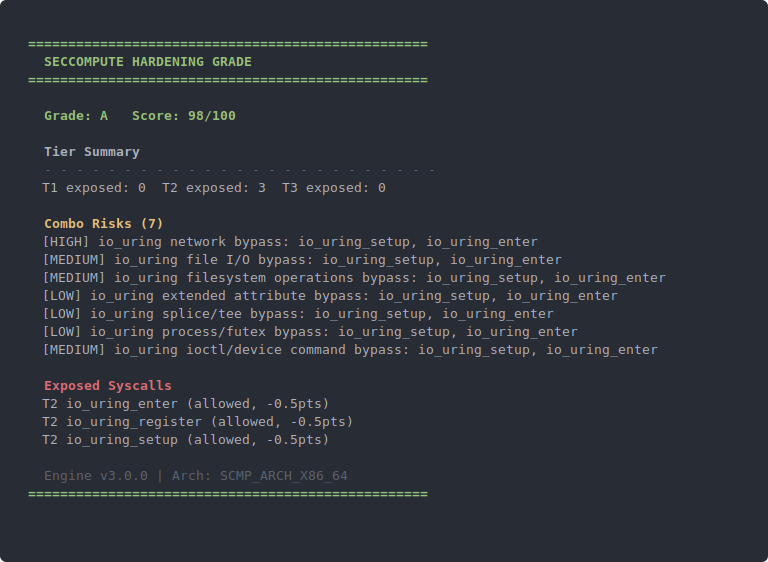
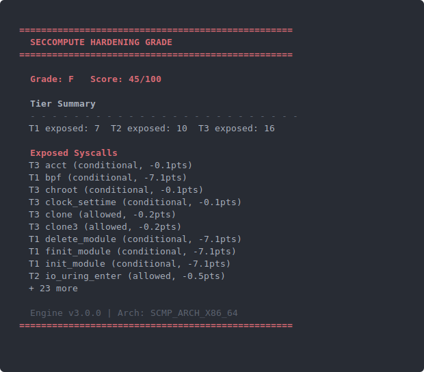

# seccompute

OCI Seccomp profile hardening score engine. CLI and python module that helps assess and score seccomp profiles for common flaws, bypasses, and general hardiness.

## Install

```bash
pip install seccompute
```

## Quickstart

```bash
seccompute - --grade << 'EOF'
{
  "defaultAction": "SCMP_ACT_ALLOW",
  "syscalls": [
    {
      "names": ["socket", "bind", "listen", "accept", "accept4", "connect",
                "sendto", "sendmsg", "sendmmsg", "recvfrom", "recvmsg", "recvmmsg"],
      "action": "SCMP_ACT_ERRNO",
    }
  ]
}
EOF
```

**Grade A — tight profile with io_uring bypass risk:**



**Grade F — permissive profile with T1 syscalls exposed:**



## CLI reference

```
seccompute [profile] [options]

input / modes:
  profile           Path to seccomp profile (JSON or YAML), or - for stdin
  --arch ARCH       Target architecture (default: SCMP_ARCH_X86_64)
  --min-score N     Exit 2 if score is below N (for CI gates)
  --compare-docker  Compare profile against Docker/Moby default seccomp allowlist
  --rules DIR       Directory with custom rule files; missing files fall back to built-ins
  --caps CAPS       Comma-separated capabilities granted to the container
                    (e.g. CAP_BPF,CAP_SYS_ADMIN). When provided, capability-
                    conditional rules are resolved against this set. Use empty
                    string to specify no capabilities. When omitted, capability
                    conditionals are ignored so Docker and containerd profiles
                    score equivalently.

output:
  --grade           Show letter-grade visualization (ANSI color)
  --format FORMAT   Output format: json (default) or text
  --json            Shorthand for --format json
  --verbose         Per-syscall details to stderr
```

## Examples

CLI:

```bash
seccompute examples/example.json                                      # JSON output
```

```bash
seccompute examples/example.json --grade                              # letter-grade visualization
```

```bash
seccompute examples/profile3-network-blocked-iouring-bypass.yaml      # YAML profile
```

Python API:

```python
from seccompute import score_profile

profile = {
    "defaultAction": "SCMP_ACT_ERRNO",
    "syscalls": [
        {"names": ["read", "write", "exit"], "action": "SCMP_ACT_ALLOW"}
    ]
}

result = score_profile(profile)
print(result.score)   # e.g. 98
print(result.grade)   # e.g. "A"
```


# Multi-Dimensional Scoring and Combo Bypasses

## Scoring model

| Tier | Examples | Max deduction |
|------|----------|---------------|
| T1 — critical | `bpf`, `ptrace`, `init_module` | 7+ pts each |
| T2 — high | `io_uring_*`, `perf_event_open` | 0.5 pts each |
| T3 — medium | `clone`, `chroot`, `mount` | 0.1–0.2 pts each |

A profile exposing any T1 syscall receives a forced **F** regardless of total score. Combo findings (e.g. io_uring bypass chains) are reported separately and do not affect the numeric score. 

## Combo Bypass Detection

When a profile allows syscall combinations that bypass seccomp restrictions, seccompute reports attack chain details — the bypass path, bypassed syscalls, and CVE/technique references:

```
[HIGH] io_uring network bypass: io_uring_setup, io_uring_enter
       bypasses: accept, bind, connect, socket, send, recv, ...
       refs: TECHNIQUE-io-uring-escape, CVE-2023-2598, CVE-2024-0582
```

### More Information
* More details: See [DETAILS.md](docs/DETAILS.md)
* Custom Roles: See [RULES.md](docs/RULES.md)
* Original Spec: See [SPEC.md](docs/SPEC.md)
* Original Prompt(Rebuild it in Rust for all I care): See [PROMPT.md](docs/PROMPT.md)
